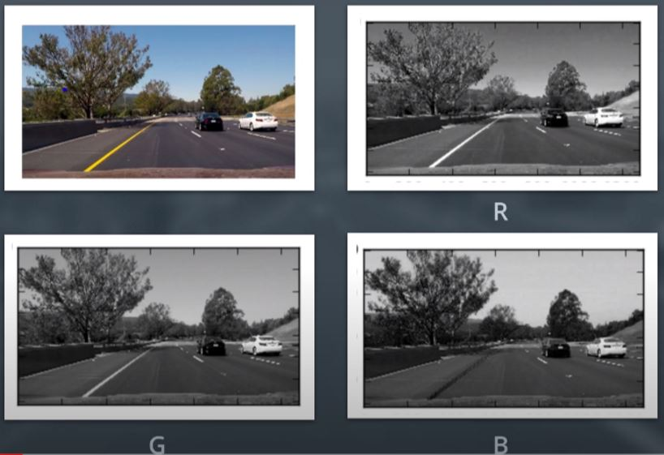
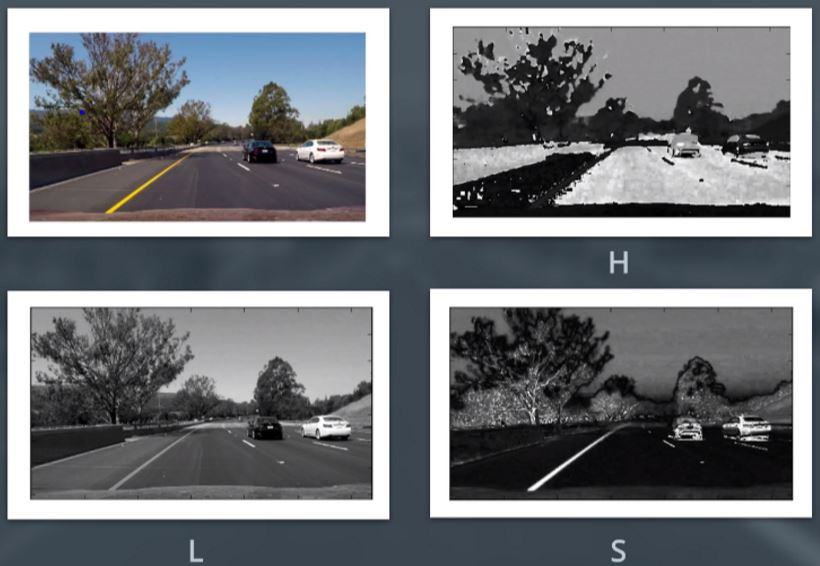
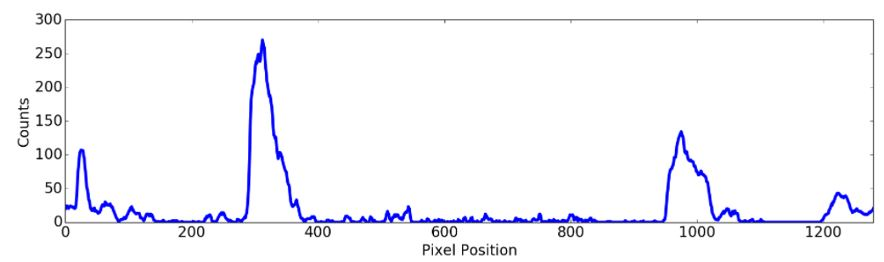

## Advanced Lane Finding Project

### Aim: Writing a software pipeline to identify the lane boundaries in a video from a front-facing camera on a car.
---

**Pipeline overview**

The various milestones of this project are as follows:

|Step|Task|
|:---:|:---|
|1|Computation of camera calibration matrix and distortion coefficients using a set of chessboard images|
|2|Application of distortion correction to raw images|
|3|Creation of a thresholded binary image using color transforms, gradients, etc.|
|4|Application of a perspective transform to rectify binary image (to get a _birds-eye view_ image)|
|5|Detection of lane pixels and fitting a curve to find the lane boundary|
|6|Determining the curvature of the lane and vehicle position with respect to center|
|7|Warp the detected lane boundaries back onto the original image|
|8|Output visual display of the lane boundaries and numerical estimation of lane curvature and vehicle position|

[//]: # (Image References)

[image1]: ./examples/undistort_output.png "Undistorted"
[image2]: ./test_images/test1.jpg "Road Transformed"
[image3]: ./examples/binary_combo_example.jpg "Binary Example"
[image4]: ./examples/warped_straight_lines.jpg "Warp Example"
[image5]: ./examples/color_fit_lines.jpg "Fit Visual"
[image6]: ./examples/example_output.jpg "Output"
[video1]: ./project_video.mp4 "Video"

---

## Camera Calibration

#### 1. Computing the camera matrix and distortion coefficients:

__Context:__ 
The goal here it to undistort a test image so that we can prepare the frames of our video for lane detection. We do this because the images near the edges (especially near corners) get stretched or skewed in various ways as cameras are not perfect as our eyes. To fix this, we'll have to caliberate our camera and apply the results (matrices obtained in the process) to our frames. Here, we'll click some pictures of our chessboard from our camera and benchmark it against a 2D ideal chessboard which is the perfect image. Using this, we'll get the transformation matrices to  undistort any image captured by our camera. 

The code for this step is contained in the first code cell of the IPython notebook located in "./project_code.ipynb"   

**Approach**:
We talk about 2 kinds of points: "object points: inner corner coordinates of our ideal chessboard" and "image points: inner corner coordinates of our images used for caliberation (that were clicked by our camera)".
 
I start by preparing "object points", which will be the (x, y, z) coordinates of the chessboard corners in the world. Here I am assuming the chessboard is fixed on the (x, y) plane at z=0, such that the object points are the same for each calibration image.  Thus, `objp` is just a replicated array of coordinates, and `objpoints` will be appended with a copy of it every time I successfully detect all chessboard corners in a test image.  `imgpoints` will be appended with the (x, y) pixel position of each of the corners in the image plane with each successful chessboard detection.  

I then used the output `objpoints` and `imgpoints` to compute the camera calibration and distortion coefficients using the `cv2.calibrateCamera()` function.  I applied this distortion correction to the test image using the `cv2.undistort()` function and obtained this result: 

![alt text][image1]

I further saved the relevent conversion matrices obtained above using pickle library. I will unpack them later in the master pipeline to undistort the frames. 


## Pipeline (single images)

### 1. Distortion-correction of frames.

`cal_undistort()` function _(called at line 565)_ distorts each frame by unpacking the pickle file containing the transformation matrices. Here's a result after I apply the distortion correction to one of the test images:
|Test Image|Undistorted Image|
|:----:|:----:|
|||
___
### 2.  Creating a thresholded image. Used color transforms and gradients to create a thresholded binary image.  

>I used a combination of color and gradient thresholds to generate a binary image. `thresh_img()`function takes care of this task.

**Gradient Threshold**: I've used gradient along the x axis emphasizes edges closer to the vertical. If we were interested in horizontal edges, we would have used gradient along the y axis. The min and max thresholds were set by trial and error till the lanes are identified witht eh lease possible noise. `xgrad_binary()` function takes care of this threshold and can be found from line 54 to 67.         

` sxbinary[(scaled_sobel >= 25) & (scaled_sobel <= 130)] = 1`

**Yellow Threshold**:  
_Task 1: Extract yellow color using H channel
Task 2: Choose optimium values for the S channel & use in combo with x_gradient_

>Reason for using HSL color space:
|RGB color space|HSL color space|
|:----:|:----:|
|||
_Note: If we use H and S channel only, and discard the information in the L channel, we should be able to detect different colors of lane lines (more reliably in RGB color space). We just need to carefully choose H and S values that distinctly identify our lane lines with least possible noise. Hue is the actual color and Saturation indicates how pure a color is._ 
 
I started by analysing the RGB values at the yellow lanes present in the given frames. For that, I first plotted the test images & used `%matplotlib notebook` command to navigate across the image to read the RGB values. Then I used a [color space conversion website](http://colorizer.org/) to study the HSL values for all the RGB values. 

By trial and error and searching for the H and S values near the values observed in the above process, 

`s_binary[(s_channel >= 100) & (s_channel <= 255)] = 1`
`h_binary[(h_channel >= 10) & (h_channel <= 25)] = 1`
_Note: When we work in OpenCV, the range of H is from 0 to 180 degrees._

Here's the logic for the yellow threshold:

`yellow_binary[(((s_binary == 1) | (sxbinary == 1) ) & (h_binary ==1))] = 1`
>_Explanation:  S channel when used within a range does a good job in identifying the lane lines but used in a combination with x_gradient ensures that we consider all vertical lane lines. We then just select the ones that are yellow in color._

**White Threshold**: 
Task1: Extract white color using RGB color space 
Task2: Use x_gradient to selectively choose the vertical edges of the lanes

We start by extracting the RGB channels and then apply threshold on the lower limit of values allowed for each channel to get the white color. We take 150 to 255 as that covers the white lanes with least noise. 

`white_binary[((r_binary ==1)&(g_binary ==1)&(b_binary ==1)&(sxbinary==1))] = 1`

**Testing the threshold**
Here's the output of my threshold applied to the test images:

`combined_binary[((yellow_binary == 1) | (white_binary == 1))] = 1`

|Test Image|Thresholded Image|
|:----:|:----:|
|||
|||
|||
|||
|||
|||
|||
|||

Note: The output image of this process has been converted to a 3D image by stacking the binary image.
___
### 3. Performing a perspective transform to get a bird eye's view of the frame (which gives a better idea of the curvature of the lane).

The code for my perspective transform includes a function called `perspective_transform()`. The `warper()` function takes as inputs an image (`img`), as well as source (`src`) and destination (`dst`) points.  I chose the source and destination points in the following manner:

```python
src = np.array(
    [[435*img.shape[1]/960, 350*img.shape[0]/540],
    [530*img.shape[1]/960, 350*img.shape[0]/540],
    [885*img.shape[1]/960, img.shape[0]],
    [220*img.shape[1]/960, img.shape[0]]], dtype='f')
dst = np.array(
    [[290*img.shape[1]/960, 0],
    [740*img.shape[1]/960, 0],
    [740*img.shape[1]/960, img.shape[0]],
    [290*img.shape[1]/960, img.shape[0]]], dtype='f')
```
_Note: The shape of image was used so that if the resolution of the image changes, the algorithm keeps working._

Then, a perspective transform matrix was found using the `src` and `dst` points. The function returns the src and dst points at the end so that the image can be un-warped later using the Inverse transformation matrix. 

I verified that my perspective transform was working as expected by drawing the `src` and `dst` points onto a test image and its warped counterpart to verify that the lines appear parallel in the warped image.

![alt text][image4]
___
### 4. Identifying lane-line pixels. 

>_**Goal:** The important outcome of sections 4.1.a and 4.1.b is to detect lane pixels on the bird eye's view. Section 4.2 fits a 2nd order polynomial onto each lane._ 

There are two levels of lane pixel identification: 
(a) **Primary**: Searching from scratch. `find_lane_pixels()`function used for this. Condition for this:`lane.count == 0`

(b) **Secondary**: Using data (coefficients of the 2nd order polynomial) from the previous frame to search nearby the previously fit lane curve. `search_around_poly()` function used for this. Condition for this:`lane.count > 0`
```python
if (lane.count == 0):
    leftx, lefty, rightx, righty = find_lane_pixels(warped_img)     
elif (lane.count > 0):
    leftx, lefty, rightx, righty = search_around_poly(warped_img, left_fit_previous[4], right_fit_previous[4])
```

### 4.1.a Finding the lane pixels from scratch.

This task is achieved by the function `find_lane_pixels()`. It takes the `warped_img`as input which is basically the bird eye's view of the road. It returns the x and y coordinates of both the lanes in 1D array format stored in the following 4 variables: `leftx`, `lefty`, `rightx`, `righty`.

>**Steps within the function:** 

1.  `histogram_bottom_peak()`function is used to get an approximate position of the lane's position at the bottom of the picture. It does a great job if:
	* The noise nearby the lane pixels is less
	* The lane is not excessively curved, atleast in the bottom half portion of the bird-eye's view. This would not work well in case of steep curvatures as the function takes the mean of x coordinates of the lane pixels. In this case, the mean might not lie at the bottom of the lane.
	
	>
	
2.  Sliding windows: We try to capture the lane within boxes of certain dimensions. We first create a box at the bottom and find the activated pixels in it. Using the average x coordinate of the pixels in that box, we shift next box (just upwards of the current one) to the left or right. 
	 
	> 
	
	Steps: 
	* We define the size of the sliding windows
	* Using `nonzero()` method, we find the activated pixels (white pixels) in the entire image. Then we store them in two different arrays as x and y coordinates. Our goal is to find the indices of the pixels coordinates from this array that particularly lie in the sliding windows that we create. Later on, we can do all sorts of analysis with just those pixels. 
	* Each iteration of defining a sliding window, we start by defining the boundaries of the window. We use the size of the window defined earlier as well as the x_mean of the pixels in the previous window. (For the 1st window, we take this value as the one identified from the histogram)
	* Then we apply the conditions of the window to all our activated pixels to get the indices that lie within our window. This is done for both: left and right lanes.
		```python
	    good_left_inds = ((nonzeroy >= win_y_low) & (nonzeroy < win_y_high) & 
        (nonzerox >= win_xleft_low) &  (nonzerox < win_xleft_high)).nonzero()[0]

        good_right_inds = ((nonzeroy >= win_y_low) & (nonzeroy < win_y_high) & 
        (nonzerox >= win_xright_low) &  (nonzerox < win_xright_high)).nonzero()[0]
		```
	* We store the indices for this window in seperate variable for both the lanes. Which are used for the following: 
		* If number of pixels in the window are above a threshold, we take the mean of the x coordinates and use it for enhancing the position of the next window
		* We eventually obtain the indices for the entire left and right lanes. Finally we obtain the coordinates of the pixels that fall in left or right lanes by passing these indices to the arrays that contain the x and y coordinates of the activated pixels. 

### 4.1.b Searching near the identified lane from the previous frame 

This task is achieved by the function `find_lane_pixels()`. It takes the `warped_img`, `left_fit` and `right_fit` as input. (Refer section 4.2 to know more about left_fit and right_fit). The function returns the x and y coordinates of both the lanes in 1D array format stored in the following 4 variables: `leftx`, `lefty`, `rightx`, `righty`.

>`left_fit`contains the coefficients of the 2nd order polynomial which we fit on our lane. In our case, our independent variable is y and dependent variable is x when the curve is fitted on the lane lines. (More on this in section 4.2)
`left_fit = [a,b,c]` for our parabola: x=a(y^2)+b(y)+c for the left lane.

>**Steps within the function:** 

1.  We start by choosing the width of the margin around the previous polynomial to search.  It works well if the lane in the current frame is not excessively curved with respect to the previous frame. The green width shown in the picture below depends on this width. 
	
	>
	
2.  Finding the pixels:
	* Using `nonzero()` method, we find the activated pixels (white pixels) in the entire image. Then we store them in two different arrays as x and y coordinates. Our goal is to find the indices of the pixels coordinates from this array that particularly lie in the region of interest near the previous lane line (shown by the green region in the above image). 
	* Then we apply the conditions of the window to all our activated pixels to get the indices that lie within our region of interest. This is done for both: left and right lanes.
		```python
        left_lane_inds = ((nonzerox > (left_fit[0]*(nonzeroy**2) + left_fit[1]*nonzeroy + 
                        left_fit[2] - margin)) & (nonzerox < (left_fit[0]*(nonzeroy**2) + 
                        left_fit[1]*nonzeroy + left_fit[2] + margin)))
        right_lane_inds = ((nonzerox > (right_fit[0]*(nonzeroy**2) + right_fit[1]*nonzeroy + 
                        right_fit[2] - margin)) & (nonzerox < (right_fit[0]*(nonzeroy**2) + 
                        right_fit[1]*nonzeroy + right_fit[2] + margin)))
		```
	* We eventually obtain the indices for the entire left and right lanes. Finally we obtain the coordinates of the pixels that fall in left or right lanes by passing these indices to the arrays that contain the x and y coordinates of the activated pixels. 

### 4.2 Fitting the positions of the identified lane pixels with a polynomial.
This is achieved by the function `fit_polynomial()`. 


 **Usage of the function:**

##### It takes in the following arguments: 

* `warped_img`: Bird eye's view image
* `leftx, lefty, rightx, righty`: Coordinates of the pixels of left and right lane
* `fit_history`: Coefficient of the 2nd order polynomial of both the lanes for the last 5 frames
* `variance_history`: Average distance of lane pixels from our curve which we have fit. This is also for both the lanes for the last 5 frames
> These 3 history variables are derived from the data stored in the `class Line()` and it's object `lane`. (explained in the next sub-section)
> 
> * The fit history is stored in the object attribute in the following format: 
> `lane.curve_fit = modify_array(lane.curve_fit, curve_fit_new)`
> >_The `modify_array` function keeps on appending `curve_fit_new = [[a1,b1,c1], [a2,b2,c2]]` for each frame and keeps a record of just the last 5 data points only._ 
> 
> * But the `fit_history` is prepared in the following manner before giving as argument to the function `fit_polynomial()`: 
> ```python
> left_fit_previous = [i[0] for i in lane.curve_fit] 
> right_fit_previous = [i[1] for i in lane.curve_fit]
> fit_history=[left_fit_previous, right_fit_previous]
> ```
> **These history variable are stored for smoothening our lane curves** when we move from frame to frame.  More  on the usage in the later sub-subsections. 

##### **The function returns the following:**
* `curve_fit_new`: This returns the coefficients of the newly fit 2nd order polynomial in the current frame. `curve_fit_new = [[a1,b1,c1], [a2,b2,c2]]` (ie. for the left and the right lanes)
* `left_fitx, right_fitx`: x coordinates of the left and right lane curves that were fit for the current frame. 
* `status`: True if the current frame had suffient points in the lanes to fit a polynomial.
* `variance_new`: Average distance of lane pixels from our curve which we have fit for the current frame.
* `ploty`: y is the independent in our case when we want to fit a curve. If we choose x, we won't get a one on one function. Hence `ploty` is a collection of all the y values of our frame from 0 to the y dimension of the image.  

##### **What does this function do?**

This function basically fits 2nd degree polynomial on the identified lane pixel poins and helps us find the coefficients of the curves as shown in the following image:


**Maintaining the history of the data of the past frames:**
We create a class as shown:

 ```python
class Line():
    def __init__(self):
        #Let's count the number of consecutive frames
        self.count = 0
        # was the line detected in the last iteration?
        self.detected = False  
        #polynomial coefficients for the most recent fit
        self.curve_fit = []  
        # Traking variance for the right lane
        self.variance = []
        #difference in fit coefficients between last and new fits. Just store the difference in coefficients for the last frame
        self.coeff_diff = [[0,0,0],[0,0,0]]        
        #Lane width measured at the start of reset
        self.lane_width = 0
        #Let's track the midpoint of the previous frame
        self.lane_bottom_centre = 0
```

We then make an object: `lane = Line()`

All the attributes are defined within the `process_image()` funtion as and when required. An example of `lane.curve_fit` has been discussed above.

**Working of the function:**
This basically fits a parabola on each lane. 

##### Basic approach:

Our job is to find a,b,c for our parabola: x=a(y^2)+b(y)+c using the coordinates of the pixels detected by us as well as using the data from the previous frames.
```python
left_fit = np.polyfit(lefty,leftx,2)     #left_fit =[a1,b1,c1]
right_fit = np.polyfit(righty,rightx,2)  #right_fit=[a2,b2,c2]
```
We then wish to find  the coordinate of the points lying on the curve that was fit. 
```python
left_fitx = a1*ploty**2 + b1*ploty + c1
right_fitx = a2*ploty**2 + b2*ploty + c2
```
##### Shortcomings:

This does't give us perfect results. There several issues if we just do this:
* Position related issues: The curves from one frame to the other weren't smooth. There was a lot of horizontal displacement related variation among the lanes. These are governed by the coefficient 'c' of a parabola.
* Shape realted issues: The parabolas obtained weren't consistent with the previous frames sometime resulting into incorrect concavity or convexity. Sometimes, the curvature was also greater than what it was supposed to be. These are governed by the coefficients: 'a' and 'b' of the parabola. 
* Insufficient data in a frame to plot any curve
* Lack of similarity between the left and the right line in a frame

##### Strategy to fix these issues:  
  
1. Availabillity of the lane pixels
* If lane pixels are found, fit a curve and get the coefficients for the left and right lane
* If number of pixels identified is insuffient and curve couldn't be fit
	- If the current frame is the 1st frame with no history, fit an arbitrary parabola with all coeff=1: Expected to improve later on.
	 - Otherwise we fit curve from the previous frame as we have the history data. For the next frame after current one, we reset the `lane.count` such that in the next frame, we start looking for the lane pixels from the scratch  
               
2) Using these coefficient we'll fit a preliminary parabola. We'll refine it with following techiniques later on: 
		- **Variance**: Minimising the average distance of the lane pixels from parabola that we fit (an attempt to decrease it). We use the data from the previous frame as well to adjust our curve coefficients
        - **Change in Coefficients**: Shape and position of parabolas in the previous frame are also utilized to optimise the current values. We try to avoid a drastic change in the coefficients in this step by comparing it with the changes in the previous frame.
        - **Frame mirroring**: Fine tuning one lane in the frame wrt to the other

_The entire explanation will be shown for one lane (say left lane). Same can be repeated for the other lane._

##### 2.a Variance:

Variance of the current frame: Finding average distance of the pixels from the preliminary curve which we just fit. 
```python
left_sum = 0
for index in range(len(leftx)):
    left_sum+= abs(leftx[index]-(a1_new*lefty[index]**2 + b1_new*lefty[index] + c1_new))
    left_variance_new=left_sum/len(leftx)
```
Variance of the old frames: Taking a weighted average over the last 5 frames giving more weightage to the most recent frame. 
```python
left_variance_old = sum([(0.2*((5-index)**3)*element) for index,element in enumerate(variance_history[0])])/sum([0.2*((5-index)**3) for index in range(0,5)])
```
>Now the plan is to modify the coefficient as follows: 
a1_new := { (a1_new)(variance_old) + (a1_old)(variance_new) } / t 
where t= variance_old + variance_new
**Logic**: If the new variance if greater than the old variance, we give more weightage to the old coefficient (Assumption: The lane pixels more or less remain at the same positions)

We first find the old value of the coefficient a1 by weighted average method:
```python 
a1_old= sum([(0.2*(index+1)*element[0]) for index,element in enumerate(fit_history[0])])/sum([0.2*(index+1) for index in range(0,5)])
```        
<br>
Then we edit the new value of a1 as explained in the logic above:

```python
a1_new = (a1_new*((left_variance_old)**2) + a1_old*((left_variance_new)**2))/(((left_variance_old)**2) + ((left_variance_new)**2)) 
```            
##### 2.b Coefficients:

Here we try to avoid a sudden change in the values of coefficients. Change is allowed but it should be similar to the change that happened in the previous frame.

	Δa1_new = | a1_new - a1_last_frame |  
```python
Δa1_old = lane.coeff_diff[0][0] #Using data from previous frame 
```

Then similar to what we did in the case of variance, we edit the value of a1 
```python
a1_new = (a1_new*(del_a1_old) + a1_old*(del_a1))/((del_a1_old) + (del_a1))
```
##### 2.c Frame mirroring :

Here, we fine tune one lane with respect to the other as they'll have similar curvature.

> **Steps:** 
1) Weighted average of the coefficients related to curve shape (a,b) to make both parabola a bit similar
	```python
	 a1 = 0.8*a1_new + 0.2*a2_new
	 a2 = 0.2*a1_new + 0.8*a2_new
	 ```
2) Adjusting the 'c' coefficient using the lane centre of previous frame and lane width according to current frame
	* In case of 1st frame, it wont have any history. But, we'll need the value of lane centre of this frame for thei next frame.
	
		> centre = (sum of x_coordinate of bottom point of both lanes)/2 
	
		```python
		lane.lane_bottom_centre = (((a2_new*(warped_img.shape[0]-1)**2 + b2_new*(warped_img.shape[0]-1) + c2_new) + (a1_new*(warped_img.shape[0]-1)**2 + b1_new*(warped_img.shape[0]-1) + c1_new))/2) 
		```        
	* For all other frames, we'll find lane width according to the latest curve coefficients till now.
		 >width = { (width of prev frame) + (x_coord_right_lane_@bottom - x_coord_left_lane_@bottom) } / 2 <br>
		 Here we've used a variable contribution which becomes 0 in case of 1st frame, otherwise is equal to 1. 
		 ```python 
		 lane.lane_width = (((lane.lane_width*contribution)+(a2_new*(warped_img.shape[0]-1)**2 + b2_new*(warped_img.shape[0]-1) + c2_new) - (a1_new*(warped_img.shape[0]-1)**2 + b1_new*(warped_img.shape[0]-1) + c1_new))/(contribution+1))
		```
	* Taking the lane centre from the previous frame and finding "c" such that both lanes are equidistant from it.
		 >Solving the math equation at the bottom of the frame:
		  (a1)(y^2)+(b1)(y)+ c1_mirror = lane_centre- (lane_width)/2    <br>
		 Rearranging the equation, we get: 
		 ```python 
		 c1_mirror = ((lane.lane_bottom_centre - (lane.lane_width/2))-(a1*(warped_img.shape[0]-1)**2 + b1*(warped_img.shape[0]-1)))
		```
	* Editing c1 using weighted average:
	`c1= 0.7*c1_new + 0.3*c1_mirror`
	* Then we find the lane centre of this frame and overwrite it over `lane.lane_width` so that be used in the next frame. 


We finally calculate the new values of x_coordinates of our lane curves which we re-fit using our new enhanced curve coefficients: 
```python
left_fitx = a1*ploty**2 + b1*ploty + c1
right_fitx = a2*ploty**2 + b2*ploty + c2
```
---

### 5. Calculating the radius of curvature of the lane and the position of the vehicle with respect to center.

##### Radius of curvature:
So far, we have been operating in the pixel space. All the units had 'pixels' as unit. To find radius of curvature, we are interested in the unit: meter. 

We can do by finding a relation between both the spaces as follows: 
```python
ym_per_pix = 30/720     # meters per pixel in y dimension
xm_per_pix = 3.7/650    # meters per pixel in x dimension
```
> **Logic:**
> We can assume that if we're projecting a section (in our bird eye's view) of lane in the field of view of the camera, the lane is about 30 meters long and 3.7 meters wide.
> Now consider the bird eye's view image. We have 720 relevant pixels in the y-dimension and roughly 650 pixels in the x dimension 

Now, we need the curve coordinates in the real world space following the metric measurement system instead of the image space. We had already found the x and y coordinates of our lane curves that we had fit using `fit_polynomial()` function. Now, we use the same coordinates, convert them to the real world space by multiplying them with the factors found above. Using the modified points, we re-fit the curve to get the corrected coefficients of our parabolas.  

```python
left_fit_cr = np.polyfit(ploty*ym_per_pix, left_fitx*xm_per_pix, 2)
right_fit_cr = np.polyfit(ploty*ym_per_pix, right_fitx*xm_per_pix, 2)
```
Using this information, we are in a position to find the radius of curvature for the left lane as follows:

R= { [ 1 + (2*a*y+b)^2] ^1.5 } / |2*a| 

```python
y_eval = np.max(ploty)   # We find the rad_of_curv @ the bottom of the lane 
left_curverad = (((1 + (2*left_fit_cr[0]*y_eval + left_fit_cr[1])**2)**1.5) / np.absolute(2*left_fit_cr[0]))
```
Then we find the average of the radius of curvature of both the lanes.

##### Offset: 

Position of the vehicle with respect to center can be found by finding the difference between the centre of the frame and centre of the frame. Then we multiply the difference with the conversion factor to convert the difference to real world space. 

`((lane.lane_bottom_centre - frame.shape[1]/2))*xm_per_pix`

---

### 6. Plotting the result back down onto the road such that the lane area is identified clearly:

a) We begin by un-warping the our bird eye's view image using the `rev_perspective_transform() function`

b) Then for each lane, we rearrange the x and y coordinates in a cyclic format so that they can be used to draw a polygon.  
* We Stack the points on the left lane from top to bottom
	 ```python
	 `pts_left = np.array([np.transpose(np.vstack([left_fitx, ploty]))])
	 ````
* Then we stack the points on the right lane from bottom to top (in the reverse order of their default arrangement)  
	```python
	pts_right = np.array([np.flipud(np.transpose(np.vstack([right_fitx, ploty])))])
	```
* Finally, we join these series of points to have them in a cyclic order (anti-clockwise here)
`pts = np.hstack((pts_left, pts_right)) `

* Next, we make a blank image with same dimensions as that our frame. We draw the lane onto this image. The lane is enclosed between 2 parabolas in the bird eye's view. We then use the `Minv` matrix to warp it to the real view by using the `warpPerspective` method of OpenCV. This is the same method that we used to tranform our frame to a bird eye view. The matrix involved at that time was `M`. Here we are using it's inverse to achieve the reverse task. 
* We take this new image generated aboved named `newwarp` and draw it over our undistorted image of our frame using `addWeighted` method from OpenCV.
* Lastly, we write the values of the radius of curvature and offset on our resultant image. 

The final result looks like this tested on a test image:


---

### Pipeline (video)

Here's a [link to my video result](/Project_Result_FINAL.mp4)

---

### Discussion

#### 1. Problems / issues faced & Where will my pipeline likely fail? 

The pipeline needs to improve on the following fronts: 
* Threshold setting so that yellow lines and white lines are detected more efficiently. When a lot of disturbance are present near the lanes in form of a secondary lane or re-constructed road or when the lighing is too low, it fails.  
* Very curved roads with low values of radius of cuvatures
* Change in the elevation of the road (hillstation ride)
